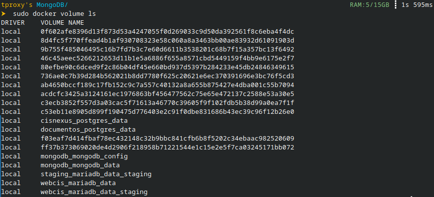

# Creación de un Contenedor Persistente de MongoDB

Sergio Emanuel Soberano Paredes 22020838 28 de septiembre del 2026

------------------------------------------------------------------------

1. [Instalación](#instalacin-de-mongodb-en-fedora-mtodo-docker)
2. [Volúmenes](#contenedor-persistente)

------------------------------------------------------------------------

## Instalación de MongoDB en Fedora (Método Docker)

Primero, crea una carpeta para MongoDB y una carpeta dentro para los
datos de la base de datos

``` bash
mkdir /home/usuario/MongoDB/
mkdir /home/usuario/MongoDB/data/
```

Después, crea un archivo compose.yml

``` bash
touch compose.yml
```

Y añade el servicio de MongoDB con la imagen oficial y su volumen

``` yaml
services:
  mongodb:
    image: mongodb/mongodb-community-server:8.0.32-ubi9-slim
    container_name: mongodb-clase

    entrypoint: ["mongod"]

    command:
      - "--bind_ip_all"
      - "--dbpath"
      - "/data/db"

    ports:
      - "27017:27017"

    volumes:
      - mongodb_data:/data/db

    restart: unless-stopped

volumes:
  mongodb_data:
```
Hasta la versión actual de la imagen de MongoDB se debe especificar el punto de entrada, esto debido a que la versión actual no permite iniciar en kernels recientes debido a una incompatibilidad, aunque en el kernel actual de Fedora ya se solucionó, la imagen sigue reconociendo cualquier kernel superior a la versión con el error como incompatible.

De esta forma ya se cuenta con MongoDB y MongoSH en el equipo. El
contenedor se inicia y se accede de la siguiente forma:

``` bash
docker compose up
docker compose exec -it mongodb mongosh
```

------------------------------------------------------------------------

## Contenedor Persistente

El contenedor persistente se logra al especificar un volumen en el
archivo compose.yml. Un volumen es almacenamiento persistente
administrado por Docker, que permite a los archivos sobrevivir a la
eliminación o reinicio de contenedores.

Se pueden ver los contenedores con el siguiente comando:

``` bash
docker volume ls
```

<figure>

<figcaption aria-hidden="true">Volumenes Creados</figcaption>
</figure>
